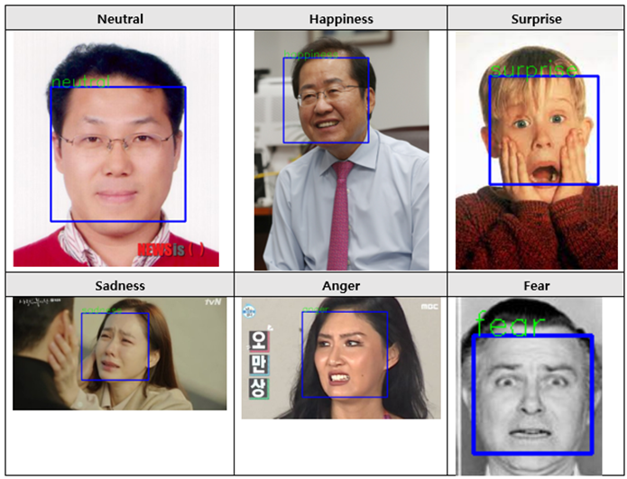
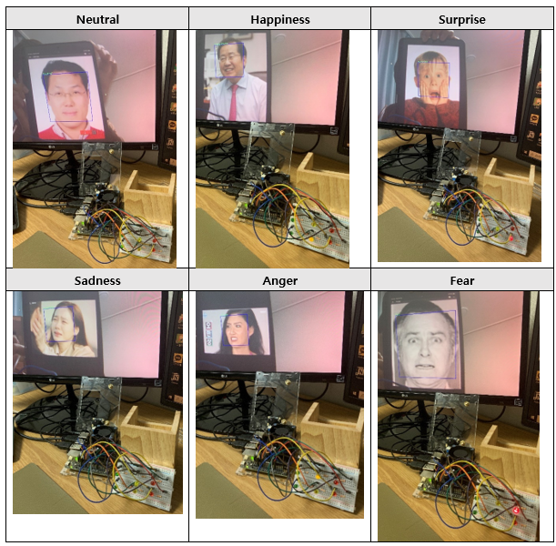

# FACIAL EXPRESSION RECOGNITION [REAL-TIME]  
✔ [REPORT](https://github.com/js-yoo/FER_NET_RT/blob/main/FER_NET_RT_REPORT.pdf)
####The codes in this repository are the codes practiced in "Embedded AI-Prof. Sungho Kim", a lecture in the Department of Electronics Engineering at Yeungnam University.

## Sample Output

## Author
----------
[@js-yoo](https://github.com/js-yoo) / [@JOONSANG YOO](https://www.linkedin.com/in/joonsang-yoo-6b781221a/)
